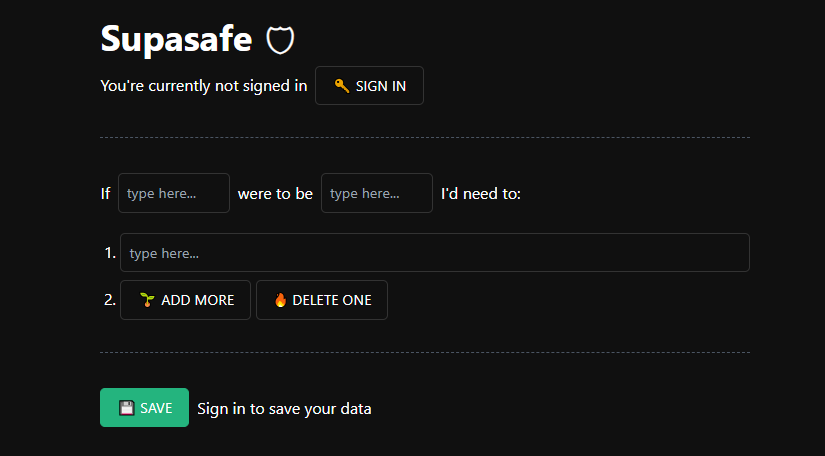

# Supasafe

The web app that helps you identify what's important when something happens.

## About

I've built this app for the Supabase Launch Week 8 Hackathon. It uses the following techs:

- Svelte for the UI
- Tailwind for styling
- Supabase as DB and auth
- Resend for the auth SMTP
- hCaptcha to prevent spam

Try it yourself at https://supasafe.mateus.zip and let me know what do you think!

> **Warning**
> This README is incomplete, I'm going to update it with steps and instructions on how to build the app

## Demonstration

<video src=".github/demo.mp4" controls title="Demonstration"></video>

## Development

Contributions are welcome! Please create an [Issue](https://github.com/mateusabelli/supasafe/issues) or [Pull Request](https://github.com/mateusabelli/supasafe/pulls) if you encounter any problems or have suggestions for improvement.

## License

Supabase is licensed under the terms of the **MIT** license. See [LICENSE.md](./LICENSE.md)
